# Architecture

```mermaid
graph TB
    subgraph "UI Layer — pages/"
        HOME[HomePage<br/>Hero + Sections]
        DETAILS[DetailsPage<br/>Metadata + Episodes]
        WATCH[WatchScreen<br/>Stream Selection]
        PLAYER[PlayerScreen<br/>Video Playback]
        SEARCH[SearchPage<br/>Debounced Search]
        CATALOG[CatalogPage<br/>Infinite Scroll]
        SETTINGS[SettingsPage<br/>Addons + Glass Toggle]
    end
    subgraph "Content Domains"
        MANGA_UI[MangaPage<br/>Discovery + Continue Reading]
        MANGA_READER[MangaReaderPage<br/>Horizontal/Vertical + Zoom]
        AUDIOBOOK_UI[AudiobooksPage<br/>Search + Continue Listening]
        AUDIOBOOK_PLAYER[AudiobookPlayerScreen<br/>Torrent/Direct + Timer]
        MUSIC_UI[MusicPage<br/>Home/Search/Browse/Library]
    end
    subgraph "Service Layer — services/"
        ADDON[AddonManager<br/>Singleton Orchestrator]
        STREAM[StreamService<br/>Aggregates All Sources]
        TORRENT[TorrentStreamService<br/>libtorrent Engine]
        SCRAPER[ScraperManager<br/>9 Pluggable Scrapers]
        METADATA[MetadataService<br/>Stremio HTTP Client]
        MANGA_SVC[MangaService<br/>WeebCentral Scraper]
        AUDIO_SVC[AudiobookScraperService<br/>9-Source Aggregator]
        MUSIC_SVC[OctaveMusicService<br/>Streaming API]
        SUBTITLE[SubtitleService<br/>Subdl Provider]
        BEST[BestSimilarScraper<br/>Recommendations]
    end
    subgraph "External"
        STREMIO[Stremio Addons<br/>Community Catalogs]
        VOD[VOD Sources<br/>VidSrc, FlyStream, etc.]
        DHT[BitTorrent DHT<br/>Peer-to-Peer]
        OCTAVE[Octave API<br/>Music Streaming]
        WEEB[WeebCentral<br/>Manga Database]
        WP[WordPress Sites<br/>Audiobook Hosts]
        ABBAY[AudiobookBay<br/>Torrent Index]
    end
    HOME --> DETAILS --> WATCH --> PLAYER
    HOME --> SEARCH & CATALOG & SETTINGS
    HOME --> MANGA_UI --> MANGA_READER
    HOME --> AUDIOBOOK_UI --> AUDIOBOOK_PLAYER
    HOME --> MUSIC_UI
    ADDON --> METADATA --> STREMIO
    STREAM --> SCRAPER & ADDON
    SCRAPER --> VOD
    TORRENT --> DHT
    MANGA_SVC --> WEEB
    AUDIO_SVC --> WP & ABBAY
    MUSIC_SVC --> OCTAVE
    SUBTITLE --> SUBTITLE
    BEST --> BEST
```

<!-- Extracted from README.md so the README stays an overview. -->



<p align="center">
  <em>The app is organized into three layers: UI pages that render content, a service layer that orchestrates data flow, and external sources that provide the actual media. Services are singletons — initialized once at startup, accessible anywhere. The scraper system uses a plugin architecture: each scraper extends <code>StreamScraper</code> and registers with the <code>ScraperManager</code>, which runs all scrapers concurrently and deduplicates results.</em>
</p>

<br/>

---

## Project Structure

```
PlayTorrioV3/
├── lib/
│   ├── main.dart                          # App entry point — engine init, addon boot, theme
│   ├── models/
│   │   ├── addon/addon.dart               # AddonManifest, InstalledAddon
│   │   ├── movie/movie.dart               # Movie catalog item
│   │   ├── movie/movie_detail.dart        # Full metadata (cast, genres, rating, runtime)
│   │   ├── movie/video.dart               # Episode/season video
│   │   ├── movie/link.dart                # External links (IMDb, trailers)
│   │   ├── movie/movie_section.dart       # Grouped catalog section
│   │   ├── stream/stream_model.dart       # Playable stream source with quality detection
│   │   ├── subtitle/subtitle_model.dart   # SubtitleVariant, SubtitleLanguageGroup
│   │   ├── manga/manga.dart               # Manga metadata
│   │   ├── manga/manga_chapter.dart       # Chapter with number parsing
│   │   ├── audiobook/audiobook_model.dart # Audiobook + AudiobookChapter
│   │   └── music/music_track.dart         # MusicTrack, MusicArtist, MusicAlbum, Playlist
│   ├── services/
│   │   ├── glass_settings.dart            # Global glass effects toggle (ValueNotifier + SharedPreferences)
│   │   ├── addon/addon_manager.dart       # Central orchestrator — install, search, catalog aggregation
│   │   ├── metadata/metadata_service.dart # Stremio HTTP client (manifest, catalog, search, meta)
│   │   ├── metadata/bestsimilar_scraper.dart  # "More Like This" recommendation engine
│   │   ├── stream/stream_service.dart     # Aggregates streams from scrapers + addons
│   │   ├── stream/torrent_stream_service.dart # Native libtorrent engine — magnet >> HTTP stream
│   │   ├── scraper/stream_scraper.dart    # Abstract base class + ScraperManager registry
│   │   ├── scraper/sites/
│   │   │   ├── flystream.dart             # FlyStream VOD scraper
│   │   │   ├── videasy.dart               # Videasy multi-CDN scraper (encrypted API)
│   │   │   ├── vidsrc.dart                # VidSrc dual-strategy scraper
│   │   │   ├── multiembed.dart            # MultiEmbed (2embed.cc) scraper
│   │   │   ├── vidcore.dart               # VidCore multi-server scraper
│   │   │   ├── fourkhdhub.dart            # 4KHDHub scraper (obfuscated redirects)
│   │   │   ├── xdownloader.dart           # XDownloader (Films365) scraper
│   │   │   ├── knaben.dart                # Knaben torrent meta-search scraper
│   │   │   ├── torrent_galaxy.dart        # TorrentGalaxy search scraper
│   │   │   └── tmdb_helper.dart           # IMDb >> TMDB ID resolution with caching
│   │   ├── subtitles/subtitle_service.dart    # Multi-provider subtitle aggregation
│   │   ├── subtitles/subtitle_provider.dart   # Abstract provider interface
│   │   ├── subtitles/subtitle_extractor.dart  # ZIP download + extraction
│   │   ├── subtitles/providers/subdl_provider.dart # Subdl.com implementation
│   │   ├── manga/manga_service.dart       # WeebCentral scraper — browse, search, read, progress
│   │   ├── audiobook/audiobook_scraper_service.dart # 9-source aggregator with parallel search
│   │   ├── audiobook/audiobookbay_scraper.dart      # AudiobookBay torrent parser
│   │   ├── audiobook/audiobook_progress_service.dart # Listening position persistence
│   │   ├── music/music_service.dart       # Octave API client
│   │   ├── music/octave_library_service.dart  # User library — likes, playlists (ChangeNotifier)
│   │   └── music/music_player_controller.dart  # Playback state machine (singleton ChangeNotifier)
│   ├── pages/
│   │   ├── home/home_page.dart            # Hero carousel + catalog sections + dock navigation
│   │   ├── details/details_page.dart      # Movie/series detail with episodes, cast, similar
│   │   ├── player/watch_screen.dart       # Stream source selection — progressive loading, quality sort
│   │   ├── player/player_screen.dart      # Full-screen video player with subtitle overlay
│   │   ├── search/search_page.dart        # Debounced multi-addon search
│   │   ├── catalog/catalog_page.dart      # Infinite scroll catalog with genre filters
│   │   ├── discover/discover_page.dart    # Search results / genre browse grid
│   │   ├── settings/settings_page.dart    # Glass toggle, addon management (install/remove/toggle)
│   │   ├── manga/manga_page.dart          # Manga discovery + continue reading
│   │   ├── manga/manga_details_page.dart  # Manga metadata + chapter list with pagination
│   │   ├── manga/manga_reader_page.dart   # Horizontal/vertical reader with zoom + progress
│   │   ├── music/music_page.dart          # Tabbed music interface (home/search/browse/library)
│   │   ├── audiobooks/audiobooks_page.dart    # Audiobook search + continue listening
│   │   ├── audiobooks/audiobook_detail_page.dart # Audiobook chapter list
│   │   ├── audiobooks/audiobook_player_screen.dart # Audiobook player with timer + speed
│   │   └── audiobooks/audiobook_route_transitions.dart # Custom player transitions
│   ├── widgets/
│   │   ├── common/custom_scroll_track.dart     # Glass scrollbar with drag + arrows
│   │   ├── common/error_view.dart              # Full-screen error with retry
│   │   ├── common/liquid_dock.dart             # macOS-style animated dock
│   │   ├── common/performance_liquid_lens.dart # Optimized glass shader presets
│   │   ├── common/poster_skeleton.dart         # Shimmer loading placeholder
│   │   ├── common/section_header.dart          # Title + subtitle + "See All"
│   │   ├── common/slider_arrow.dart            # Glass arrow button for carousels
│   │   ├── movie/movie_card.dart               # Responsive poster card with hover
│   │   ├── movie/movie_slider_section.dart     # Horizontal scrollable row with arrows
│   │   └── manga/manga_card.dart               # Manga poster card with type badge
│   └── utils/
│       ├── parse_torrent_title.dart         # 100+ regex patterns — parses any torrent filename
│       ├── relevance_scorer.dart            # Tiered relevance scoring for search results
│       └── route_transitions.dart           # LiquidRevealRoute + CinematicSlideRoute
├── assets/
│   ├── icon.png                             # App icon (all platforms)
│   ├── subfont.ttf                          # Subtitle rendering font
│   ├── js/cheerio.bundle.js                 # Server-side DOM parsing (JS scraper runtime)
│   └── scrapers/
│       ├── sources.json                     # Scraper registry — 9 entries, version 1.0.0
│       ├── flystream.js                     # FlyStream JS scraper
│       ├── videasy.js                       # Videasy JS scraper (encrypted API)
│       ├── vidsrc.js                        # VidSrc JS scraper
│       ├── multiembed.js                    # MultiEmbed JS scraper
│       ├── vidcore.js                       # VidCore JS scraper
│       ├── fourkhdhub.js                    # 4KHDHub JS scraper
│       ├── xdownloader.js                   # XDownloader JS scraper
│       ├── knaben.js                        # Knaben JS scraper
│       └── torrent_galaxy.js                # TorrentGalaxy JS scraper
├── libass_plugin/                           # iOS native plugin — bundles ass.framework for ASS/SSA subtitles
│   ├── pubspec.yaml
│   ├── lib/libass_plugin.dart
│   └── ios/
│       ├── libass_plugin.podspec
│       └── ass.framework/
├── android/                                 # Android platform — Gradle build, Kotlin app delegate
├── ios/                                     # iOS platform — Swift app/scene delegates, Xcode project
├── macos/                                   # macOS platform — Swift app delegate, entitlements
├── linux/                                   # Linux platform — CMake, C++ runner, GTK embedding
├── windows/                                 # Windows platform — CMake, C++ runner, Win32 embedding
├── test/
│   ├── widget_test.dart                     # Smoke test — the app renders and settles
│   ├── services/                            # Settings wiring, media session, scrapers, backup
│   ├── widgets/                             # Browse scaffold, nav shell, library tabs, sub-tabs
│   └── models/                              # My List keys, movie/stream/addon parsing
├── pubspec.yaml                             # Flutter project config — dependencies, assets, launcher icons
├── analysis_options.yaml                    # Dart lint rules
└── README.md                                # This file
```

<br/>

---

## Key Architectural Patterns

### Singleton Services

Nearly all services follow the singleton pattern — initialized once, accessed globally:

```dart
class AddonManager {
  static final AddonManager instance = AddonManager._internal();
  factory AddonManager() => instance;
  AddonManager._internal();
  // ...
}

// Usage anywhere in the app:
AddonManager.instance.fetchAllHomeSections();
```

Services using this pattern: `AddonManager`, `TorrentStreamService`, `ScraperManager`, `SubtitleService`, `MusicPlayerController`, `OctaveLibraryService`, `MangaService`.

### Plugin Scraper Architecture

Scrapers implement a common interface and register with a central manager. Adding a new source requires only implementing `StreamScraper`:

```dart
class MyNewScraper extends StreamScraper {
  @override
  String get name => 'MyNewScraper';
  
  @override
  Future<List<StreamSource>> scrape({...}) async {
    // Custom scraping logic
  }
}

// Registration:
ScraperManager.instance.register(MyNewScraper());
```

The manager handles concurrent execution, timeout enforcement, deduplication, and error isolation automatically.

### Progressive Loading

Content is streamed to the UI as it arrives rather than waiting for all sources to complete. Both the home screen's catalog sections and the watch screen's stream sources use `StreamController` to yield results progressively, batched at 60ms intervals to maintain smooth frame rates.

### Responsive Card Sizing

`MovieCardSizing` and `MangaCardSizing` are factory classes that compute card dimensions from screen width:

```dart
class MovieCardSizing {
  final double cardWidth;
  final double posterHeight;
  
  factory MovieCardSizing(BuildContext context) {
    final width = MediaQuery.of(context).size.width;
    if (width < 600) return MovieCardSizing._(cardWidth: 138, posterHeight: 207);
    if (width < 900) return MovieCardSizing._(cardWidth: 155, posterHeight: 232);
    // ...
  }
}
```

This pattern ensures consistent visual density across phones, tablets, and desktop windows without media query duplication in every widget.

### LRU Caching

Metadata, search results, and scraper responses use least-recently-used caches to avoid redundant network requests during a session. Caches are cleared when addons change. The `MetadataService` caches catalog queries, search results, and metadata lookups separately. The `BestSimilarScraper` caps its autocomplete cache at 80 entries and details cache at 30 entries.

### Error Isolation

A single failing scraper or addon never blocks the rest. Every concurrent operation is wrapped in try-catch and silently skipped on failure. The `ErrorView` widget provides a consistent full-screen error state with a retry button for catastrophic failures. The `ScraperManager` catches per-scraper errors and continues with remaining scrapers. The `AddonManager` marks failed addons and continues serving results from healthy ones.

<br/>
